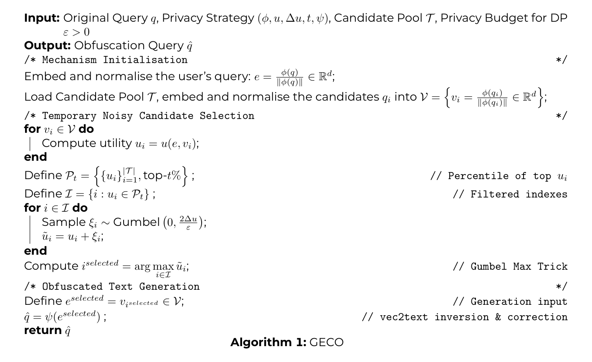
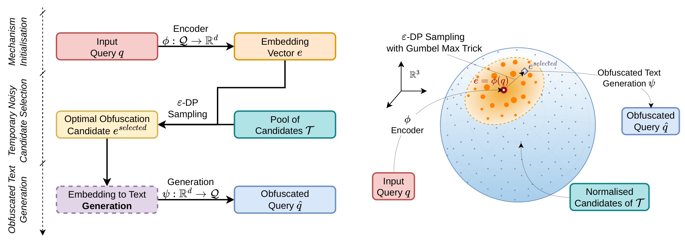

<div align="center">

<!-- BANNER / LOGO -->


<h2>GECO: Generating Contextually Obfuscated Texts with Differential Privacy </h2>
<h4>⚡ Providing Contextual Privacy to plain texts using Differential Privacy and Generative AI ⚡</h4>

<!-- BADGES -->
<p align="center">
  <a href="https://img.shields.io/badge/license-GNU_GPL_3.0-blue.svg">
    
  </a>
  <a href="https://img.shields.io/badge/python-3.10%2B-blue.svg">
    
  </a>
  <a href="https://img.shields.io/badge/conda-24%2B-blue.svg">
    
  </a>
  <a href="https://img.shields.io/badge/OS-Linux%20%7C%20Windows%20%7C%20MacOS-lightgrey.svg">
    
  </a>
  <a href="https://img.shields.io/badge/status-release-green.svg">
    
  </a>
</p>


[Explore the Docs](#-documentation) · [Report a Bug](https://github.com/) · [Request Feature](https://github.com/)

</div>

---

## 🧭 Table of Contents

- [🧭 Table of Contents](#-table-of-contents)
- [🔍 About the Project](#-about-the-project)
  - [🛠 Built With](#-built-with)
- [🚀 Getting Started](#-getting-started)
- [📂 Project Structure](#-project-structure)
- [📚 Methodology](#-methodology)
- [📊 Results](#-results)
- [📖 Conclusion](#-conclusion)
---

## 🔍 About the Project

> _Query obfuscation is a client-side technique that involves masking the user's private and sensitive query before submitting it to a non-privacy-collaborative Information Retrieval (IR) system. Traditional query obfuscation mechanisms rely on the gold-standard mathematical framework of $\varepsilon$-Differential Privacy (DP) and, to generate the obfuscated text, use a predefined word-embedding space or sample from a publicly available query log. In this paper, we introduce a new algorithm, called GECO, based on the formal definition of DP, that generates the privatised queries using sequence-to-sequence generation. While adhering to the formal privacy guarantees of $\varepsilon$-DP, it exploits different ways of privatising a user query's text and does not limit the obfuscation to sampling from a predefined set of known queries; instead, it generates new ones. From our empirical findings, we show that the GECO algorithm outperforms traditional baselines that rely on static noisy DP representations or basic sampling, achieving greater effectiveness in the downstream query-obfuscation task while providing stronger privacy guarantees for the user's query._


### 🛠 Built With
- [Python 3.10+](https://www.python.org/downloads/)
- [Vec2Text](https://github.com/Vec2Text/Vec2Text)
- [Numpy](https://numpy.org/)
- [Pandas](https://pandas.pydata.org/)
- [PyTorch](https://pytorch.org/)
- [Transformers](https://huggingface.co/docs/transformers/index)
- [IR Datasets](https://ir-datasets.com/)
- [TQDM](https://tqdm.github.io/)

## 🚀 Getting Started
1. Clone the repository

2. Generate the environment using the `env.yml` file in `./config/` folder. You can use the following command to create a conda environment:
```bash
conda env create -f config/env.yml
```
Then verify the environment:
```bash
conda env list
```

1. Activate the environment:
```bash
conda activate geco
```

Now you can run the code in the repository with all the dependencies installed. Once you are done, you can deactivate the environment:
```bash
conda deactivate
```

In the `./config/requirements.txt` file, you can find the list of packages used in the project. 

## 📂 Project Structure
```GECO/
├── config/
│   ├── env.yml
│   └── requirements.txt
├── geco/
│   ├── src/
│   │   ├── AbstractGECO.py
│   │   ├── CorrelationGECO.py
│   │   ├── RBFGECO.py
│   │   ├── CosineGECO.py
│   └── utils.py 
│   └── __init__.py
├── results/
├── main.py
├── README.md
└── .gitignore
```
All the source code for the GECO algorithm is located in the `./geco/src/` folder. The `main.py` file contains the main execution code for running the experiments. The `results/` folder is where the output of the experiments will be stored. The `config/` folder contains the environment configuration and requirements for the project.

## 📚 Methodology
The pseudocode for the GECO algorithm is as follows:



More specifically, the algorithm takes as input a user query $q$, a privacy budget $\varepsilon$, and a set of parameters that controls how the obfuscated queries are generated. The algorithm then produces as output a set of obfuscated queries that are differentially private with respect to the original query $q$. The initial step is related to the encoding of the query $q$ into a vector representation. This is done using a pre-trained language model, such as T5 or GTR, which produces a dense vector representation of the query. The next step is to generate a set of candidate obfuscated queries by sampling from a distribution that is defined over the vector space. By exploting the *Exponential Mechanism* of DP, the algorithm samples from a set of public queries a candidate that will be used in the last step to produce the final obfuscated query. The final step is to decode the selected candidate vector back into a text query using the methodology of sequence-to-sequence generation defined by Morris et al. in [1]. 

The overall process and its geometric intuition is reported as follows:



[1] John Morris, Volodymyr Kuleshov, Vitaly Shmatikov, and Alexander Rush. 2023. Text Embeddings Reveal (Almost) As Much As Text. In Proceedings of the 2023 Conference on Empirical Methods in Natural Language Processing, pages 12448–12460, Singapore. Association for Computational Linguistics.

## 📊 Results

## 📖 Conclusion