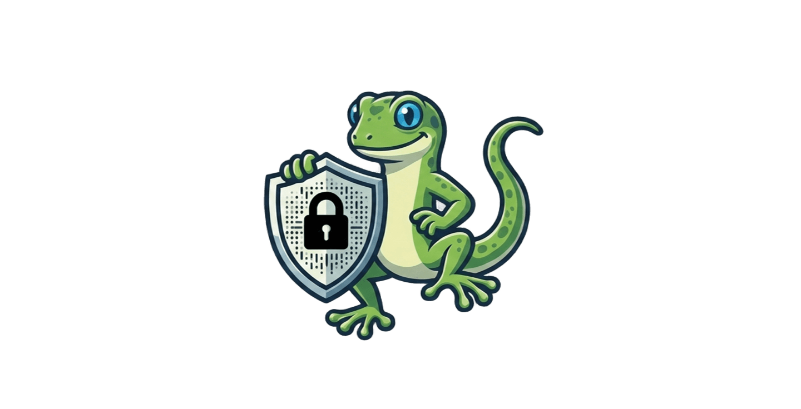

<!-- BANNER / LOGO -->

<h2>GECO: Generating Contextually Obfuscated Text with Differential Privacy </h2>
<h4>⚡ Providing Contextual Privacy to plain texts using Differential Privacy and Generative AI ⚡</h4>

<!-- BADGES -->

  
  
  
  
  

[Explore the Docs](#-documentation) · [Report a Bug](https://github.com/) · [Request Feature](https://github.com/)

---

## 🧭 Table of Contents

- [🧭 Table of Contents](#-table-of-contents)
- [🔍 About the Project](#-about-the-project)
  - [🛠 Built With](#-built-with)

---

## 🔍 About the Project

> _Brief Description of the Project_

Long description of the project, its goals, and its significance. 

### 🛠 Built With
